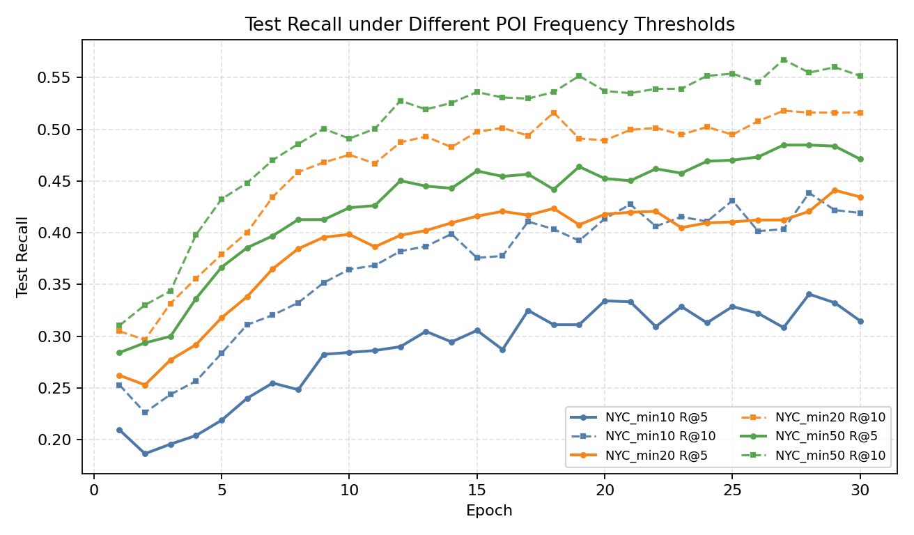
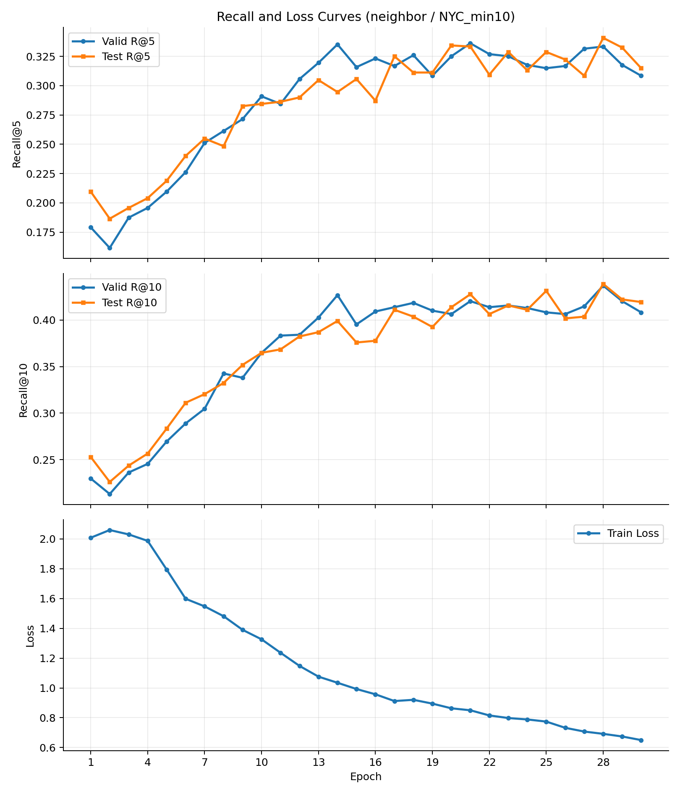
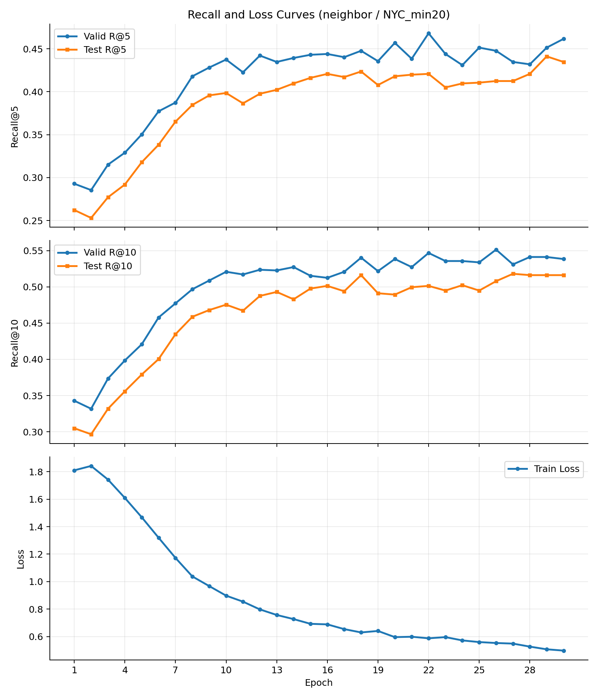
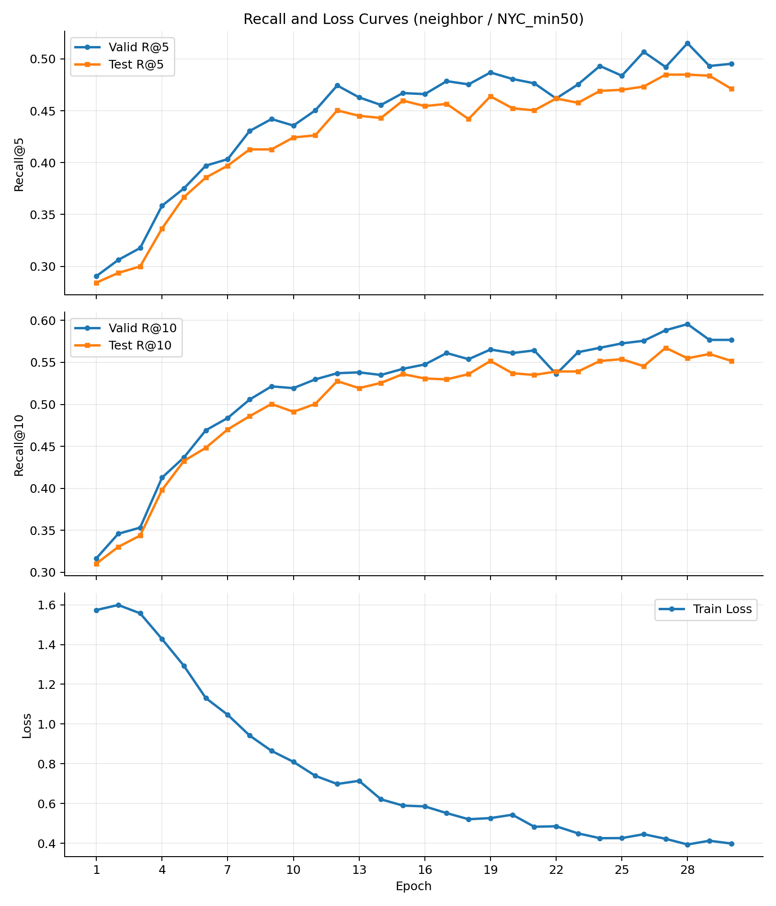

# Collaborative STAN for Next-POI Recommendation

A research-oriented extension of the Spatio-Temporal Attention Network (STAN) for next-point-of-interest recommendation. The project preserves the original two-stage spatio-temporal attention path and injects a candidate-conditioned collaborative term into the second matching stage.

## Main contribution

For a candidate POI \(l\), the baseline matching score is extended with collaborative evidence:

\[
s_l = s_l^{\text{STAN}} + \lambda C(h,l)
\]

Three formulations of \(C\) are implemented:

1. **Prototype:** cosine similarity between the trajectory representation and a destination prototype updated with momentum.
2. **Neighbor-shared prototype:** a distance-weighted mixture of nearby destination prototypes. This was the strongest variant in the experiments.
3. **Contrastive:** a learned destination bank and projection head trained with an auxiliary contrastive objective.

## Results

The table reports the best validation-Recall@5 epoch for the neighbor-shared variant and the corresponding test metrics. Increasing the minimum POI frequency produced a cleaner, less sparse benchmark and stronger ranking performance.

| NYC split | Best val R@5 | Test R@5 | Test R@10 |
|---|---:|---:|---:|
| Minimum 10 visits | 0.3333 | 0.3407 | 0.4386 |
| Minimum 20 visits | 0.4615 | 0.4347 | 0.5162 |
| Minimum 50 visits | 0.5152 | 0.4848 | 0.5549 |



<details>
<summary>Training curves</summary>







</details>

## Code structure

```text
load.py                 trajectory preprocessing and spatial matrices
models.py               baseline STAN model
layers.py               attention layers
train.py                baseline training/evaluation
collab_common.py        collaborative memories, models and trainer
train_proto.py          prototype variant
train_neighbor.py       neighbor-shared prototype variant
train_contrastive.py    contrastive variant
run_stan_collab.sh      reproducible SLURM entry point
```

## Setup

```bash
python -m venv .venv
source .venv/bin/activate  # Windows: .venv\Scripts\activate
pip install -r requirements.txt
```

Place the public NYC check-in arrays under `data/`:

```text
data/NYC.npy
data/NYC_POI.npy
```

The dataset is not redistributed here. Large preprocessing caches, checkpoints and raw logs are also excluded.

Generate a filtered split, then run a collaborative model:

```bash
python load.py --dname NYC --output_dname NYC_min20 \
  --min_loc_visits 20 --min_user_checkins 6
python train_neighbor.py --dname NYC_min20 --part 0 --epochs 30 \
  --collab_weight 0.5 --top_k 16 --neighbor_temperature 1.0
```

On a SLURM cluster:

```bash
PROJECT_DIR=/path/to/project sbatch run_stan_collab.sh neighbor NYC_min20 0 30
```

## Experimental safeguards

- Prototype memories are updated only from training prefixes.
- Validation and test labels never update the collaborative memory.
- The contrastive destination bank is learned only through training supervision.
- The original one-user-at-a-time trajectory loop is retained to minimize unintended changes to the baseline.

## Attribution and scope

This is a course research reproduction and extension of STAN, not a claim of authorship of the baseline architecture or dataset. The collaborative term, its three variants, experiment runner and threshold study are the focus of this repository. Refer to the original STAN publication and its official implementation when reusing the baseline code. No license is asserted here for upstream code or data.
